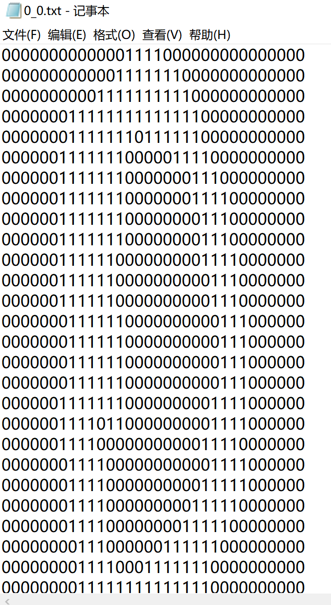
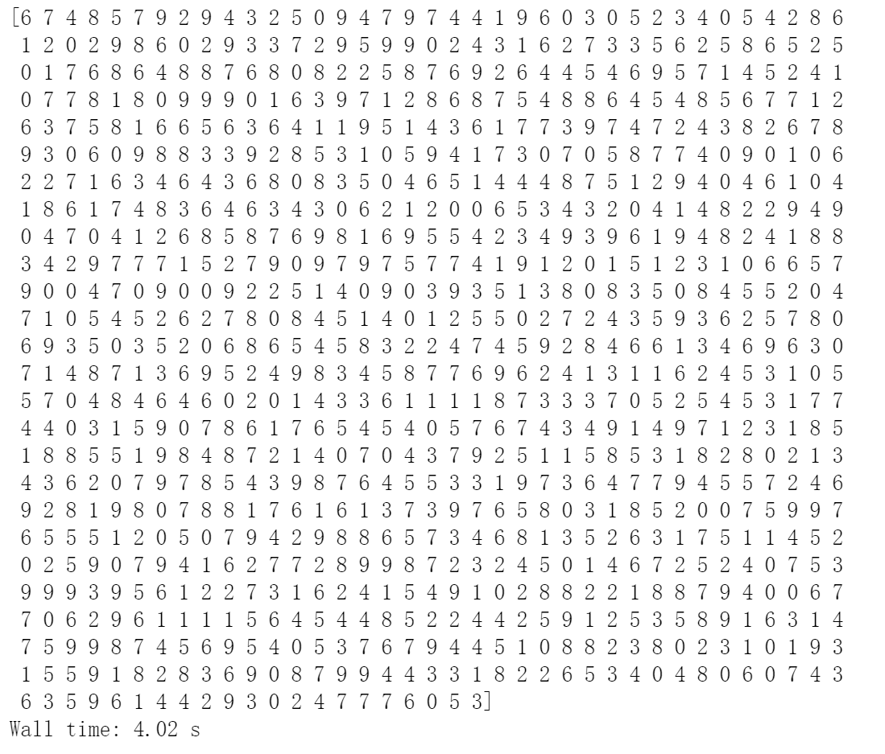
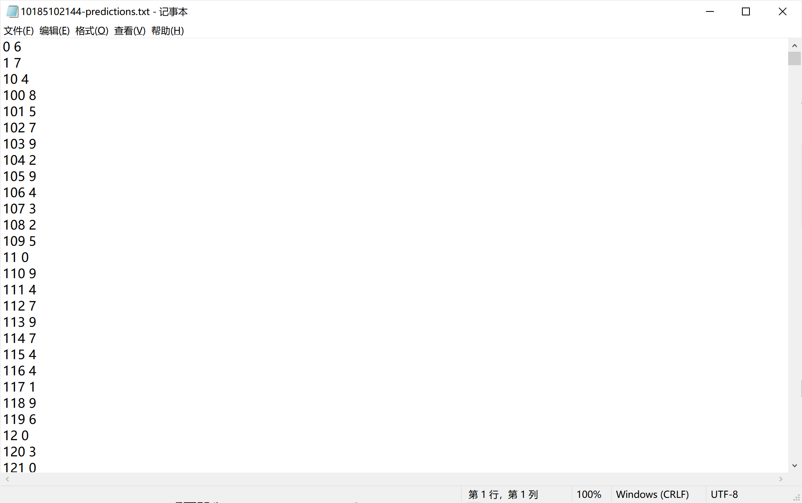

# 华东师范大学计算机科学与技术实验报告

| 实验课程：数据挖掘 | 年级：2018        | 实验成绩：             |
| ------------------ | ----------------- | ---------------------- |
| 指导教师：兰曼     | 姓名：董辰尧      | 提交作业日期：2021/6/8 |
| 实践编号：2        | 学号：10185102144 | 实践作业编号：2        |

[TOC]


## 一、实验名称：手写数字识别

识别手写数字

## 二、实验目的

掌握本地数据的读写，实现手写数字识别

## 三、实验内容

### 3.1训练集处理

#### 3.1.1观察数据格式


发现训练集的文件名称是“答案_文件编号”的形式，在读取数据的时候可以考虑把这两部分分开读。



所有的数据形式是32*32的数字矩阵，所以在读取单个文件的数据的时候要注意数据的格式。

#### 3.1.2所有文件的读取

```python
# 获取数据文件
fileList = os.listdir('./data/trainingDigits/')

# 定义数据标签列表
trainingIndex = []
# 添加数据标签
for filename in fileList:
    trainingIndex.append(int(filename.split('_')[0]))

# 定义矩阵数据格式
trainingData = np.zeros((len(trainingIndex),1024))
print(trainingData.shape)#(1498, 1024)
```

这里trainingData训练集的矩阵是（文件数1498，单个文件的数字个数32*32）

#### 3.1.3单个文件的读取

```python
# 获取矩阵数据
index = 0
for filename in fileList:
    with open('./data/trainingDigits/%s'%filename, 'rb') as f:
        
        # 定义一个空矩阵
        vect = np.zeros((1,1024))
        
        # 循环32行
        for i in range(32):
            # 读取每一行数据
            line = f.readline()
            
            # 遍历每行数据索引  line[j] 即为数据
            for j in range(32):
                vect[0,32*i+j] = int(line[j])
        
        trainingData[index,:] = vect
        index+=1
```

这里单个文件每次读一行，读取完毕后把读出来的数据矩阵vect填入上一步定义好的trainingData训练集矩阵中去。

### 3.2测试集读取

这个读取步骤和上一步相同。但是需要注意的是测试集的文件名称只有序号，由于提交的预测结果是“序号+结果”的形式，所以在这里略有不同，需要得到序号的列表。

### 3.3KNN

#### 3.3.1训练

```python
from sklearn.neighbors import KNeighborsClassifier
# 定义k为3个, 即寻找最近的3个邻居
knn = KNeighborsClassifier(n_neighbors=3)
# 训练数据
knn.fit(trainingData,trainingIndex)
```

这里直接导包进行训练

#### 3.3.2预测

```python
%%time
# 预测数据 
predict_data = knn.predict(testData)
print(predict_data)
```

这里直接打出预测数据



### 3.4写入预测文件

```python
# 我们生成一个新的数据文本，并将所有结果写入新文件
with open('10185102144-predictions.txt', 'w',encoding='utf-8') as f:
    for i in range(len(testIndex)):
        f.write(str(testIndex[i])+' '+str(predict_data[i])+'\n') 
f.close()
```

这里注意要求的序号＋结果的格式

## 四、实验结果及其分析

### 4.1预测结果截图



## 五、问题讨论（实验过程中值得交待的事情）

### 5.1结果乱序

写结果的时候一开始以为自己的预测结果顺过来就对应着1、2、3、4......结果出来之后比较好奇自己做的对不对，结果我发现正确率很低，这让我很是惊讶，因为在验证机上进行验证的时候正确率一般是97%以上，后来发现我的文件序号列表是不是按顺序来的，答案也不是按照顺序来的，所以要一一对应。

### 5.2图片转txt

本来我以为这次给的数据集是图片，所以我参考老师的代码，写了图片转化成txt的程序

```python
import sys
from PIL import Image
# 将256灰度映射到16个字符上
def image_to_text(pixels, width, height):
    symbols = list("01") 
    string = ""
    for h in range(height):
        for w in range(width):
            rgb = pixels[w, h]
            string += symbols[int(sum(rgb) / 3.0 / 256.0 * len(symbols))]
        string += "\n"
    return string
    # 加载并调整大小
def load_and_resize_image(imgname, width, height):
    img = Image.open(imgname)
    if img.mode != 'RGB':
        img = img.convert('RGB')
    w, h = img.size
    rw = width * 1.0 / w
    rh = height * 1.0 / h
    r = rw if rw < rh else rh
    rw = int(r * w)
    rh = int(r * h)
    img = img.resize((rw, rh), Image.ANTIALIAS)
    return img
# 图片转为文本
def image_file_to_text(img_file_path, dst_width, dst_height):
    img = load_and_resize_image(img_file_path, dst_width, dst_height)
    pixels = img.load()
    width, height = img.size
    string = image_to_text(pixels, width, height)
    return string
```

### 5.3KNN

这次结果直接导包过于偷懒，所以我还完成了一个自己写的knn算法，试验过，发现准确率并不算高

```python
def draw(X):
    group,label = init()
    plt.scatter(group[:,0],group[:,1])
    plt.scatter(X[0],X[1])
    plt.show()
def knn(group,k,labels,input):
    x = group.shape[0]#行数
    new_array = np.tile(input,(x,1))#线性代数矩阵思维
    new_array -= group
    new_array **= 2
    new_array = np.sum(new_array,axis = 1)#每行相加获得的是行向量 axi=0 每列求和
    diatance = new_array**0.5 #距离列表
    #对距离进行排序
    sorted_distance = np.argsort(diatance) #小到大排序返回下标的列表
    map = {}#装k个
    for i in range(k):
        #sorted_distance labels k
        #3 A 0
        #1 A 1
        #0 B 2
        string = labels[sorted_distance[i]]
        map[string] = map.get(string,0)+1
    cnt = 0
    for key,value in map.items():
        if value > cnt:
            cnt = value
            res_string = key
    return res_string
```


## 六、结论

这次作业学习到了很多知识，从数据的挖掘，处理，利用，每一步都有更深刻的理解。