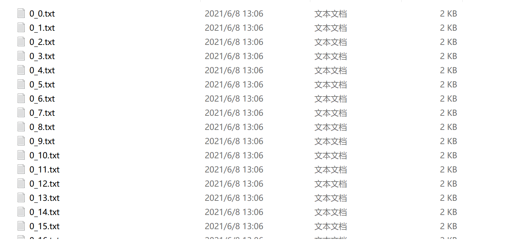

# 华东师范大学计算机科学与技术实验报告

| 实验课程：数据挖掘 | 年级：2018        | 实验成绩：              |
| ------------------ | ----------------- | ----------------------- |
| 指导教师：兰曼     | 姓名：董辰尧      | 提交作业日期：2021/4/30 |
| 实践编号：2        | 学号：10185102144 | 实践作业编号：2         |

[TOC]


## 一、实验名称：手写数字识别

识别手写数字

## 二、实验目的

掌握本地数据的读写，实现手写数字识别

## 三、实验内容

### 3.1训练集处理

#### 3.1.1观察数据格式



发现训练集的文件名称是“答案_文件编号”的形式，在读取数据的时候可以考虑把这两部分分开读。


所有的数据形式是32*32的数字矩阵，所以在读取单个文件的数据的时候要注意数据的格式。

#### 3.1.2所有文件的读取

```python
# 获取数据文件
fileList = os.listdir('./data/trainingDigits/')

# 定义数据标签列表
trainingIndex = []
# 添加数据标签
for filename in fileList:
    trainingIndex.append(int(filename.split('_')[0]))

# 定义矩阵数据格式
trainingData = np.zeros((len(trainingIndex),1024))
print(trainingData.shape)#(1498, 1024)
```

这里trainingData训练集的矩阵是（文件数1498，单个文件的数字个数32*32）

#### 3.1.3单个文件的读取

```python
# 获取矩阵数据
index = 0
for filename in fileList:
    with open('./data/trainingDigits/%s'%filename, 'rb') as f:
        
        # 定义一个空矩阵
        vect = np.zeros((1,1024))
        
        # 循环32行
        for i in range(32):
            # 读取每一行数据
            line = f.readline()
            
            # 遍历每行数据索引  line[j] 即为数据
            for j in range(32):
                vect[0,32*i+j] = int(line[j])
        
        trainingData[index,:] = vect
        index+=1
```

这里单个文件每次读一行，读取完毕后把读出来的数据矩阵vect填入上一步定义好的trainingData训练集矩阵中去。

## 四、实验结果及其分析


## 五、问题讨论（实验过程中值得交待的事情）


## 六、结论

这次作业学习到了很多知识，从数据的挖掘，处理，利用，每一步都有更深刻的理解。