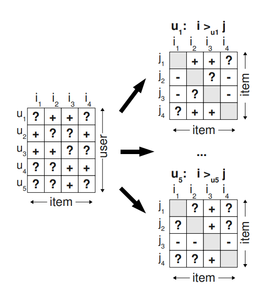

### BPR-OPT

Rendle S ,  Freudenthaler C ,  Gantner Z , et al. BPR: Bayesian personalized ranking from implicit feedback[C]// UAI 2009, Proceedings of the Twenty-Fifth Conference on Uncertainty in Artificial Intelligence, Montreal, QC, Canada, June 18-21, 2009. AUAI Press, 2009.

**背景：**

全称叫做贝叶斯个性化排序，此方法的提出主要是针对TOPN推荐任务，当时的TOPN推荐任务主要是取预测评分的TopN来进行推荐，而这些预测评分基本上都是利用前面提及到的通过降低实际值与预测值之间的最小平方差而求到的，而事实上，这样求出来的预测评分高低并不能代表用户心目中的一个排序的高低！这样的排序是没有用的，所以你会看到即使我们的RMSE等指标都很好，但是准确率以及召回率等TopN评价指标都很低。
所以作者提出的BPR专门针对TopN的排序任务，训练也是训练排序而不是训练预测评分值，那么怎么样去操作呢？作者提出了以下假想，他提出如果你面对 i 物品和 j 物品的时候选择了 i 物品，则表示相对于 j 物品来说，你更喜欢 i 物品。所以我们的做法是在训练的时候加大用户对 i 物品的喜欢程度和对 j 物品喜欢程度的一个差值，并且这个差值越大越好。
**方法：**

上面的公式是bpr的通用公式，可以把它套在任何一个现存的方法上进行训练。

把用户-物品矩阵分解成单独的用户矩阵，表示用户对物品对之间的喜爱的偏好。

### SBPR

Tong Z ,  Mcauley J ,  King I . Leveraging Social Connections to Improve Personalized Ranking for Collaborative Filtering[C]// the 23rd ACM International Conference. ACM, 2014.

**背景：**

这篇工作第一次把社交网络关系加入到了BPR的猜想中，该作者认为**用户都会更加倾向于用户朋友喜欢的东西**，而目前的很多工作并没有考虑到这一点。

**方法：**

1、用户更加喜欢自己有过正向反馈的物品而不是有过负向反馈或者没有过反馈的物品（与BPR的猜想一致）; 2、用户更加偏向于用户的朋友喜欢的物品而不是自己有负向反馈或者没有反馈的物品。

### BPRDR

Xu K ,  Xu Y ,  Min H , et al. Improving Item Ranking by Leveraging Dual Roles Influence[J]. IEEE Access, 2018, 6:57434-57446.

**背景：**

**作者认为用户选择某一个物品不仅仅会受自己信任的人所影响，也会受信任自己的人所影响**，所以这两点因素都应该要被考虑进去。

**方法：**

1、用户更加倾向于自己喜欢的物品而不是信任他的人喜欢的物品；2、用户更加倾向于自己喜欢的物品而不是他信任的人喜欢的物品；3、用户更加倾向于他信任的人喜欢的物品而不是自己、他信任、信任他的人都不喜欢的物品。

### TNDBPR

Yangjun, Ke, Cai, et al. Leveraging Distrust Relations to Improve Bayesian Personalized Ranking[J]. Information, 2018.

**背景：**

**在以往的算法中往往都只考虑了利用信任信息，比如前一篇文章BPRDR，而没有人利用过用户之间的不信任信息**。而事实上，利用这一块信息也是至关重要的，利用用户之间的不信任信息可以帮助用户排除掉用户不信任的人喜欢的物品。

**方法：**

* 作者把物品分为了四种类型，分别是：1、Positive feedback，这一类物品是用户有过用户行为的物品；2、Trust feedback，这一类物品是用户没有过用户行为的物品，但是至少有他的一个信任者对该物品有过用户行为；3、Distrust feedback，这一类物品是用户和用户信任者都没有过用户行为的物品，但是至少有一个用户的不信任者对其有过用户行为的物品；4、Neutral feedback，这一类物品是用户和用户信任的人以及用户不信任的人都没有过用户行为的物品；
* 作者提出了以下三个猜想：1、用户更加倾向于喜欢有过Positive feedback的东西而不是有过Trust feedback的东西；2、用户更加倾向于喜欢有过Trust feedback的东西而不是有过Neutral feedback的东西；3、用户更加倾向于喜欢有过Trust feedback而不是有过Distrust feedback的东西；

