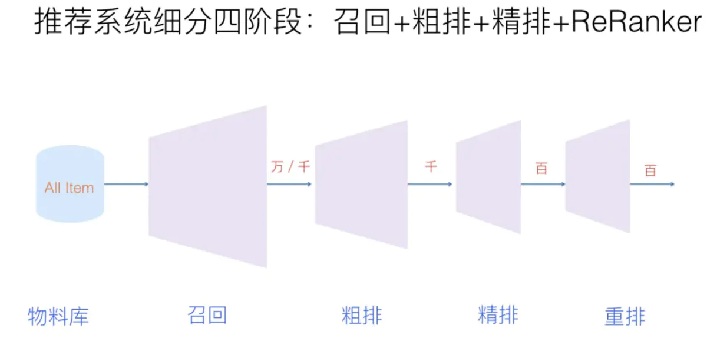

# 推荐系统期末报告（论文调研）

[TOC]

大型的推荐系统分为4个阶段：召回 --> 粗排 --> 精排 --> 重排

这次我主要关注点在最后的排序上面。

## MF

Koren Y ,  Bell R ,  Volinsky C . Matrix Factorization Techniques for Recommender Systems[J]. Computer, 2009, 42(8):30-37.

#### **背景：**

MF的提出是为了缓解用户物品矩阵的数据稀疏性以及为了提升推荐的准确性。

#### **方法：**

* 该方法把用户物品评分矩阵拆解成两个矩阵，分别是用户矩阵P和物品矩阵Q。用户矩阵P中的每一行都是一个用户向量表示，物品矩阵Q中的每一列都是一个物品向量表示，我们使用得到的P中的第 i 行和Q中的第 j 列相乘可以得到用户 i 对物品 j 的一个预测评分值。
* 在训练的时候，通过不断的缩小实际值与预测值的一个最小平方误差我们可以训练出最后的P和Q矩阵。

## IF-MF

 Hu Y ,  Koren Y ,  Volinsky C . Collaborative Filtering for Implicit Feedback Datasets[C]// Eighth IEEE International Conference on Data Mining. IEEE, 2009.

#### **背景：**

这一篇论文的提出主要是为了处理隐性反馈数据，隐性反馈数据在现实生活中其实是比显性反馈数据要多很多的，所以我们应该去充分的利用这份数据去进行推荐工作，但是目前来说，我们对于隐性反馈数据的利用率不是很高，主要是因为**隐性反馈数据并不能和显性反馈数据一样去显性的表示出用户的偏好**。

#### **方法：**

作者认为隐性反馈数据的数值大小多少能够反映出用户对物品的偏好，这篇论文中利用的数据集是作者爬取的一个关于用户看电视节目的这么一个隐性反馈数据集，按照现实的理解，如果数据显示用户观看某一个电视节目1-2次，那么有可能是因为用户喜欢这个电视节目，也很有可能只是因为用户换台的时候经过或者无聊的时候在这个电视节目上做了停留，我们确实不能从这份数据中获取到用户的一个偏好。但是若是用户观看某个电视节目10多次呢？这确实是能够充分体现出用户对这个电视节目的一个喜好程度的。基于此，作者提出了一个叫置信程度的东西，置信程度在这里用$C_{ui}$来表示。如果某一条隐性反馈数据能够反映用户偏好的话，则置信程度值会高，否则就会低，而这里的置信程度值完全和隐性反馈值是成正相关的。

## CB-MF

Zhao G ,  Lee M L ,  Hsu W , et al. Community-based user recommendation in uni-directional social networks[J]. ACM, 2013.

#### **背景：**

这篇工作是2013年发表在CIKM上的一篇工作。这篇工作关注的是社交网络上的用户推荐任务，**由于关注者-被关注者矩阵非常稀疏，利用普通的MF进行矩阵分解操作并不能缓解准确率不高的事实**。

#### **方法：**

作者提出是否可以把该关注者-被关注者矩阵按照用户兴趣分成多个小矩阵，然后再来进行矩阵分解，作者最后利用LDA技术来获取到所有用户的关注者们的一个兴趣主题分布以及兴趣主题分布下的用户群体。再利用兴趣主题分布下的用户群体去进行小矩阵的划分，最后再在每个小矩阵上面进行矩阵分解。

## UIS-MF

Xu K ,  Zheng X ,  Cai Y , et al. Improving User Recommendation by Extracting Social Topics and Interest Topics of Users in Uni-Directional Social Networks[J]. Knowledge-Based Systems, 2017:S0950705117305002.

#### **背景：**

UIS-MF这篇工作也是用来处理社交网络上的用户推荐任务。这篇论文提出的其中之一原因与CB-MF原因一致，即由于关注者-被关注者矩阵非常稀疏，利用普通的MF进行矩阵分解操作并不能缓解准确率不高的事实，另外一个原因是CB-MF也没有考虑到的，即关注者关注被关注者可能是因为兴趣原因，但仍然有可能是因为社交原因，因为在线下认识的朋友，我们倾向于在线上也是朋友，而这一点在目前的论文中都没有被考虑到。

#### **方法：**

使用基于原始LDA得到的兴趣分布下的用户群体显然是很粗糙的，如果我们能够使用改进的UIS-LDA进行训练，则我们可以得到兴趣分布下的用户群体以及社交分布下的用户群体，基于这两个群体去进行小矩阵的划分，会比前者考虑的更加细致，得到的群体矩阵更加精致和准确，最后用户推荐任务的准确率也会更好。

## DuLDA-MF

Ke X ,  Yi C ,  Min H , et al. Top-N Trustee Recommendation with Binary User Trust Feedback[M].  2018.

#### **背景：**

在信任网络中，用户去信任并且关注某一个人有时候并不仅仅是因为用户本身的一个兴趣原因，也有可能是因为被关注者本身影响力很高值得信任的原因。而现有的大部分做法，不管是在社交网络中也好，或者是在信任网络中也好，都只考虑了关注者（信任者）本身兴趣偏好，而没有考虑过被关注者（被信任者）所拥有的影响力的原因。

#### **方法：**

作者提出这个想法之后，对原始的LDA进行了改进操作，在工作UIS-LDA中我们只输入了用户关注者们表示的文档，得到了一个用户关注者的兴趣主题分布，而这里，我们对LDA进行训练，分别输入两个文档，一个是信任者的被信任者们的一个文档表示，另一个是被信任者的信任者们的一个文档表示，由此可以得到两个主题分布，分别是信任者们的兴趣分布，以及被信任者们的一个影响力分布，同时我们可以获得这两个分布下的用户分布。利用该用户分布，我们可以参照CB-MF的做法，划分小矩阵群体，把大的信任者-被信任者用户矩阵划分成很多的小的兴趣矩阵以及影响力矩阵，分别进行矩阵分解操作。

## 从MF到BPR

#### **矩阵分解的缺陷：**

矩阵分解是通过预测用户对候选物品的评分，然后根据这个预测评分去排序，最后再推荐给用户。这种方法是一种典型的 Pointwise 方法，无论是预测评分还是预测隐式反馈，本质上都是在预测用户对一个物品的偏好程度。

但是这种方法有很大的问题，因为很多时候我们只能收集到少数正例样本，剩下的数据其实是真实负例和缺失值的混合构成（这里的缺失值是指训练数据中除正例和负例外的未知数据，可以理解为未曝光或者曝光了的但是用户可能没有注意到缺失数据，所以缺失值中的样本即有可能是正例，也有可能是负例），而我们**用这种方法构建训练数据的时候，往往无法确定负例到底是哪些，就只能把除正例以外的其他部分都当作是负例，这就会使得训练数据中负例的一部分其实是缺失值。**把缺失值当作是负样本，再以预测误差为评判标准去使劲逼近这些样本。逼近正样本没问题，但是同时逼近的负样本只是缺失值而已，真正呈现在用户面前，并不能确定是不喜欢还是喜欢。而且，这样的模型仅能预测正例或负例，对于类别内的样本无法深入区别其重要性，不利于排序。

当然，对于这种情况，我们也可以用一些其他方法来规避这些问题，比如负例采样，比如按预测概率排序，但这些方法也仅仅是缓兵之计，对于解决排序问题来说并不完善。

#### **使用BPR解决：**

* BPR 利用 Pairwise 的思想来构建偏序关系，它依然没有从无反馈数据中去区分负例样本和缺失值，不过和之前的方法不一样的是，BPR 不是单纯地将无反馈数据都看做是负例，而是与正例结合一起来构建偏序关系。

* 偏序关系是反对称的，因此隐式地考虑了负样本。

## BPR-OPT

Rendle S ,  Freudenthaler C ,  Gantner Z , et al. BPR: Bayesian personalized ranking from implicit feedback[C]// UAI 2009, Proceedings of the Twenty-Fifth Conference on Uncertainty in Artificial Intelligence, Montreal, QC, Canada, June 18-21, 2009. AUAI Press, 2009.

#### **背景：**

全称叫做贝叶斯个性化排序，此方法的提出主要是针对TOPN推荐任务，当时的TOPN推荐任务主要是取预测评分的TopN来进行推荐，而这些预测评分基本上都是利用前面提及到的通过降低实际值与预测值之间的最小平方差而求到的，而事实上，这样求出来的预测评分高低并不能代表用户心目中的一个排序的高低。这样的排序是没有用的，所以即使的RMSE等指标都很好，但是准确率以及召回率等TopN评价指标都很低。
所以作者提出的BPR专门针对TopN的排序任务，**核心假设是，某用户对他有过反馈的物品的偏好程度一定比没有反馈过的物品高**，提出如果你面对 i 物品和 j 物品的时候选择了 i 物品，则表示相对于 j 物品来说，你更喜欢 i 物品。所以我们的做法是在训练的时候加大用户对 i 物品的喜欢程度和对 j 物品喜欢程度的一个差值，并且这个差值越大越好。

#### **方法：**

上面的公式是bpr的通用公式，可以把它套在任何一个现存的方法上进行训练。

把用户-物品矩阵分解成单独的用户矩阵，表示用户对物品对之间的喜爱的偏好。

**核心假设是，某用户对他有过反馈的物品的偏好程度一定比没有反馈过的物品高**（这里的反馈一般指隐式反馈，如点击浏览等，不涉及负反馈），未反馈的物品包括真正的负例以及缺失值。BPR 试图通过用户的反馈矩阵 S 来为每一个用户构建出完整的偏序关系，也称全序关系。BPR 其实可以看作在准确率之上更加高层的排序算法框架。

## SBPR

Tong Z ,  Mcauley J ,  King I . Leveraging Social Connections to Improve Personalized Ranking for Collaborative Filtering[C]// the 23rd ACM International Conference. ACM, 2014.

#### **背景：**

这篇工作第一次把社交网络关系加入到了BPR的猜想中，该作者认为**用户都会更加倾向于用户朋友喜欢的东西**，而目前的很多工作并没有考虑到这一点。

#### **方法：**

1、用户更加喜欢自己有过正向反馈的物品而不是有过负向反馈或者没有过反馈的物品（与BPR的猜想一致）; 2、用户更加偏向于用户的朋友喜欢的物品而不是自己有负向反馈或者没有反馈的物品。

## BPRDR

Xu K ,  Xu Y ,  Min H , et al. Improving Item Ranking by Leveraging Dual Roles Influence[J]. IEEE Access, 2018, 6:57434-57446.

#### **背景：**

**作者认为用户选择某一个物品不仅仅会受自己信任的人所影响，也会受信任自己的人所影响**，所以这两点因素都应该要被考虑进去。

#### **方法：**

  * u prefers her observed item i to any of her trustee’s observed item k;
  * u prefers her observed item i to any of her truster’s observed item s;
  * u prefers her trustee’s observed item k over item j that neither herself nor her trusters/trustees observed.
  * $X_(u,i)≥ X_(u,k) , X_(u,i)≥ X_(u,s) , X_(u,k)≥ X_(u,j)$

1、用户更加倾向于自己喜欢的物品而不是信任他的人喜欢的物品；2、用户更加倾向于自己喜欢的物品而不是他信任的人喜欢的物品；3、用户更加倾向于他信任的人喜欢的物品而不是自己、他信任、信任他的人都不喜欢的物品。

## TNDBPR

Yangjun, Ke, Cai, et al. Leveraging Distrust Relations to Improve Bayesian Personalized Ranking[J]. Information, 2018.

#### **背景：**

**在以往的算法中往往都只考虑了利用信任信息，比如前一篇文章BPRDR，而没有人利用过用户之间的不信任信息**。而事实上，利用这一块信息也是至关重要的，利用用户之间的不信任信息可以帮助用户排除掉用户不信任的人喜欢的物品。

#### **方法：**

* 

* 作者把物品分为了四种类型，分别是：1、Positive feedback，这一类物品是用户有过用户行为的物品；2、Trust feedback，这一类物品是用户没有过用户行为的物品，但是至少有他的一个信任者对该物品有过用户行为；3、Distrust feedback，这一类物品是用户和用户信任者都没有过用户行为的物品，但是至少有一个用户的不信任者对其有过用户行为的物品；4、Neutral feedback，这一类物品是用户和用户信任的人以及用户不信任的人都没有过用户行为的物品；
* 作者提出了以下三个猜想：1、用户更加倾向于喜欢有过Positive feedback的东西而不是有过Trust feedback的东西；2、用户更加倾向于喜欢有过Trust feedback的东西而不是有过Neutral feedback的东西；3、用户更加倾向于喜欢有过Trust feedback而不是有过Distrust feedback的东西；

## PRM

Changhua Pei,Yi Zhang,Yongfeng Zhang,Fei Sun,Xiao Lin,Hanxiao Sun,Jian Wu,Peng Jiang,Junfeng Ge,Wenwu Ou,Dan Pei. Personalized re-ranking for recommendation[P]. Recommender Systems,2019.

#### **背景：**

排序阶段从标记的数据集中学习排序功能以优化全局性能，从而为每个单独的物品生成一个得分。但是可能不是最佳选择，因为评分功能分别应用于每个物品，并且没有明确考虑物品之间的相互影响以及用户偏好或意图的差异。

#### **方法：**

在重排序阶段引入了Transformer结构来对每一个物品对关系进行建模，从而直接优化整个推荐列表，进一步提高性能。

物品对之间的相互影响可以直接从现有LTR模型为请求r给出的初始列表 = [，，...，]中学习。但是，很少有模型考虑用户和项目之间的交互。 物品对的相互影响程度因用户而异。 本文引入了个性化矩阵PV来学习用户特定的编码功能，该功能可以对物品对之间的个性化相互影响进行建模。

新的loss定义如下：

比上面的loss多了PV（个性化向量矩阵），其他的是一样的，Sr是初始化列表，参数变成来re-rank模型的参数。

个性化部分，用来产生PV向量，在整个模型训练的一开始就要先进行预训练。是用户u交互过的所有物品，除此之外，用户的性别，年龄等信息也会作为特征输入。当然这个模型还可以用fm,ffm.deepfm等来替代，把最后一层的vector拿出来当PV就可以来。

其实就是在重排的时候加入了用户的个性化内容（用户自己的+用户和物品的互动关系）和物品对之间的关系。

