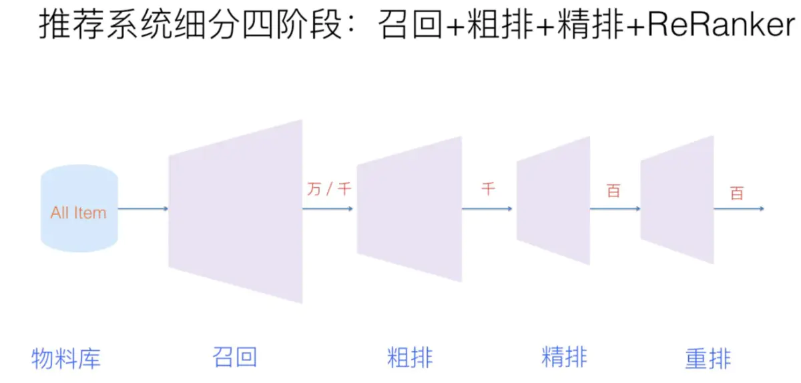
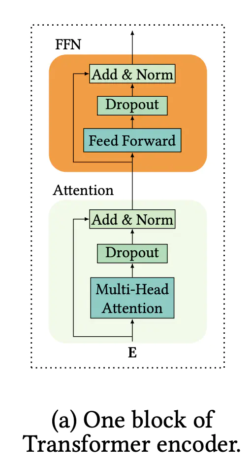
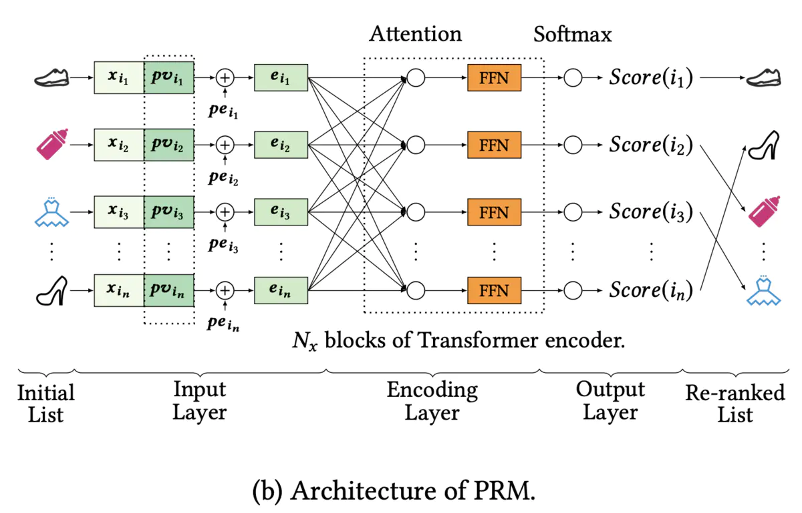
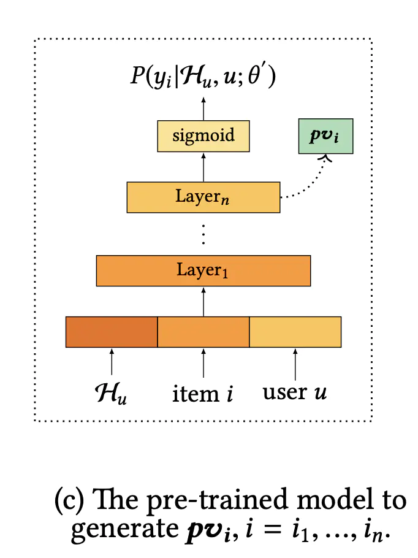

### 论文题目：《Personalized Re-ranking for Recommendation》

论文链接：[https://arxiv.org/pdf/1904.06813.pdf](https://links.jianshu.com/go?to=https%3A%2F%2Farxiv.org%2Fpdf%2F1904.06813.pdf)

大型的推荐系统分为4个阶段：召回 --> 粗排 --> 精排 --> 重排

这个论文讲的是最后一个阶段：重排。

排序阶段从标记的数据集中学习排序功能以优化全局性能，从而为每个单独的物品生成一个得分。但是可能不是最佳选择，因为评分功能分别应用于每个物品，并且没有明确考虑物品之间的相互影响以及用户偏好或意图的差异。所以，在重排序阶段引入了Transformer结构来对每一个物品对关系进行建模，从而直接优化整个推荐列表，进一步提高性能。

其实就是在重排的时候加入了用户的个性化内容（用户自己的+用户和物品的互动关系）和物品对之间的关系。

