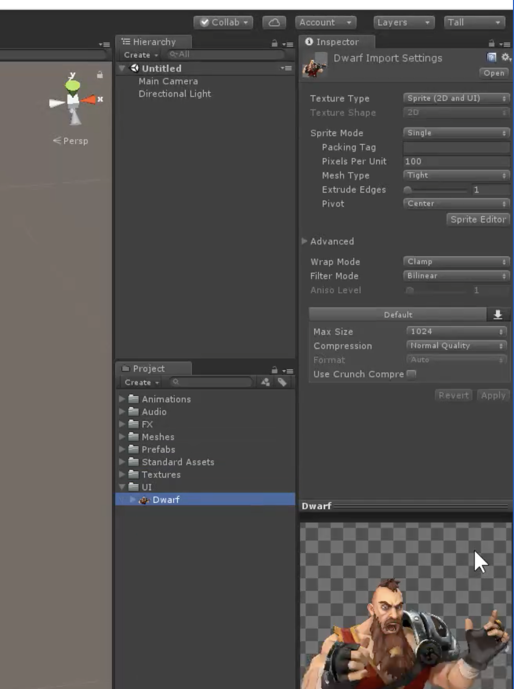
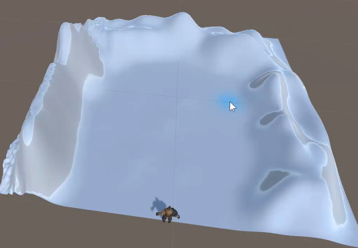

# 项目技术报告

[TOC]

| 姓名：李泽浩   | 学号：10185102142 |
| -------------- | ----------------- |
| 工作方式：组队 | 工作历时：20小时  |

## 一、问题描述

结合OpenGL、DirectX或者某一图形引擎实现一个虚拟场景的绘制，要有必要的漫游交互。要求最好能用到1-2种真实感图形技术，有一定的逼真度。

## 二、问题分析

在unity中设计四周地形，材质的贴图，光源位置、亮度、色调，中间空地的物品选择及摆放等，如何才能营造出一个幽静且逼真的古墓废墟的环境。从众多材质包中选择符合主题的材质，并通过prefab的使用简化了火焰、树木等材质的尺寸调节等属性。

## 三、技术方法

### 3.1导入素材

这从我们在网络上，以及unity官方的assetstore上找了素材，并导入，最后效果如下。

### 3.2创建地形

#### 3.2.1创建初步地形

首先加入一个地形，然后使用地形刷，地形刷类似于一个刷子，可以改变地形。调整刷子的大小，并使用润滑功能，最后的效果图和刷子设置如下：

#### 3.2.2添加地形贴图

地形中有贴图选项，需要注意的是，有的贴图还有相应的法线贴图，也需要加上。经过不断试验，我最后选择了GrassRockyAlbedo。效果如下：

#### 3.2.3布置石头（创建山体）

在场景中加入prefab中的石头，并且多复制几个，不断调整石头的位置，这样四周凸起的地方就变成了山体。效果如下：

### 3.3场景美化

#### 3.3.1添加古墓素材

我从之前导入的预制体的素材中挑选了一些古墓素材进行调整，需要注意不能使素材太突兀，亦或是使素材悬空。

#### 3.3.2添加植被

为了效果更逼真，我添加了不同类型的植被，有的是unity自带，有的是网上找到的资源。

至此，古墓的整体布局大致已经完成。

### 3.4灯光效果

#### 3.4.1直射光

由于是古墓环境，需要让整体灯光变暗一些。unity中的直射光模仿的就是太阳直射，仔细观察发现天空盒中还有太阳的影子，所以只要让直射光从下往上照射就可以模拟出晚上的效果。

这样方便后续添加火焰的效果。

#### 3.4.2点光源

现在场景有点太黑了，需要一定数量的点光源进行点缀。我选择了一些蓝色光和一些黄色光。最后效果如下：

## 四、分析讨论

前期环境的搭建遇到了不少问题，通过unity的进一步学习，一一解决并受益匪浅。

### 贴图优化

贴图资源是游戏当中消耗最大的资源，贴图资源的管理直接影响到整个游戏内存的性能。

- 使用图集：使用图集能够很好解决drawcall过高的问题。Unity中的SpritePacket能够很好地帮助我们建立图集，而且支持剥离透明通道，帮助我们更好地压缩图集文件，减少资源内存的占用。

- 对于通用纹理，尽可能的使用九宫格。如果用大块的纹理则会占用较大的内存空间。而针对对称纹理则可以使用shader或者Scale翻转等方法来重复利用以减小内存消耗。
- 对于有较明显的远近关系的物体，我们可以使用Mipmap来减少运行时渲染的带宽。如果没有这种需要的话（例如2D场景和UI）则需要及时关闭，因为会占用一定的内存空间。Unity中也有Mipmap视图提供给我们进行查看：
- 通过设置“MaxSize”来限制图片的大小，一般来说我们应该讲图片缩小到肉眼刚好看不出压缩的程度。图片不要超过2048.
- “Format”则表示压缩的方式，不同的平台我们应该用不同的压缩方式来进行压缩。例如：安卓使用ETC而IOS则使用PVRTC。
- 一般情况下我们需要关闭图片的Read&Write选项，否则内存会大一倍。除非我们对图像需要进行读写操作。
- 针对颜色范围不大的素材，我们可以降低图片的色阶以减小图片的大小。

