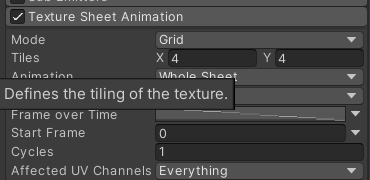
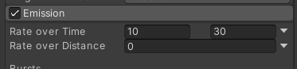

# 项目技术报告

[TOC]

| 姓名：董辰尧   | 学号：10185102144 |
| -------------- | ----------------- |
| 工作方式：组队 | 工作历时：10小时  |

## 一、问题描述

结合OpenGL、DirectX或者某一图形引擎实现一个虚拟场景的绘制，要有必要的漫游交互。要求最好能用到1-2种真实感图形技术，有一定的逼真度。

## 二、问题分析

实现虚拟场景可以使用Unity，建立一个虚拟场景并进行角色的漫游交互。关于逼真度我们准备使用unity的粒子效果和动画结合来进行火焰的模拟。

**我在这次小组的任务主要是实火焰的模拟、人物的移动、以及摄像机的跟随。**

## 三、技术方法

### 3.1火焰的模拟

#### 3.1.1准备工作

首先创建一个灯的模型，取名叫Bonfire。这个模型将要由下面的石墩、上面的灯笼、一个点光源和一个粒子系统组成，


#### 3.1.2粒子系统使用

在火堆下方创建一个Particle System粒子系统，用于模仿火焰效果。


上面是我设置好的参数。我主要改了如下几个方面：

* Start Lifetime：是粒子存在的时长或是粒子的生命。这个参数越大，粒子存在时间就越久。
* Start Speed：粒子的速度。这里我调成一个范围1.78到5，为了更好地模仿火焰的效果。
* 为了使粒子呈现出火焰的效果，我使用了提前导入的一个4\*4的动画，制作成了一个材质并且应用在render里。最后为了使动画播放，在粒子系统的设置里的Texture Sheet Animation中选上4*4如下图所示。
  

* Size over Lifetime:由于火焰的粒子应该是由大变小，所以调成下降的函数。


* Emission里修改一次发射的数量。这里设置成了10到30之间。

  

  目前的效果是这样的：

  


#### 3.1.3动画效果

仅仅做出来火焰的表面效果是不够的，因为此时我们的火焰仍然是由一个静止的点光源发射光线。所以需要对点光源创建动画，使其亮度闪烁并且位置摇曳。


上图就是创建的动画效果，具体需要先开起录制然后录制几个关键帧，在关键帧的地方改变亮度和位置，动画播放的时候会自动填满其他帧来实现动画效果

> 在这里为了不让我做的6个火堆播放的动画太同步，这样会不够真实，所以我为每一个火焰都创建了自己的动画。

### 3.2人物的漫游交互

#### 3.2.1导航网格生成

为了使人物移动，需要先生成导航网格，这样unity才知道应该怎么去导航。选择Window->AI->Navigation。


期中Agent Height是人物的高度，Max Slope是能爬的最大坡度，Step Height是人物的步长。这些需要符合实际。最后烘焙好的网格是这样的：


#### 3.2.2控制人物移动

这里需要使用脚本完成。创建一个脚本叫Hero。

并且应用一下。

相关代码如下

```c#
using System.Collections;
using System.Collections.Generic;
using UnityEngine;
using UnityEngine.AI;

public class Hero : MonoBehaviour
{
    public NavMeshAgent agent;
    public Animator anim;
    // Start is called before the first frame update
    void Start()
    {
        
    }

    // Update is called once per frame
    void Update()
    {
        if(Input.GetMouseButtonDown(0)) {
            Ray ray = Camera.main.ScreenPointToRay(Input.mousePosition);
            RaycastHit hit;
            if (Physics.Raycast(ray, out hit))
            {
                //hit.point
                print(hit.point);
                agent.SetDestination(hit.point);
            }
        }
        anim.SetFloat("speed", agent.velocity.magnitude);
    }
}

```

其中Ray ray = Camera.main.ScreenPointToRay(Input.mousePosition)用来把屏幕坐标转化成射线。

if (Physics.Raycast(ray, out hit))
            {
                agent.SetDestination(hit.point);
            }

用来判断鼠标是否点击，并通过射线检测的方法返回鼠标点击位置。最后再使用 agent.SetDestination(hit.point);来使人物移动到目标位置。

#### 3.2.3人物动作（静止、走路、跑步）

我已经提前导入了人物的不同动作，但是还不能播放，需要一个动画状态机控制。


这里需要注意一下逻辑问题，静止、走路和跑步动画之间的转换条件如何。这里的条件是判断Speed大小如何。

上面代码中的anim.SetFloat("speed", agent.velocity.magnitude)是获取当前速度，并赋值给speed，这样动画机才知道speed怎么改变。

### 3.3控制摄像机跟随

首先需要调整好摄像机的位置，使其处在人物上方。然后创建一个脚本FollowTarget进行跟随。代码如下：

```C#
using System.Collections;
using System.Collections.Generic;
using UnityEngine;

public class FollowTarget : MonoBehaviour
{

    public Transform hero;

    private Vector3 offset;

    // Use this for initialization
    void Start()
    {
        offset = transform.position - hero.position;
    }

    // Update is called once per frame
    void Update()
    {
        transform.position = offset + hero.position;
    }
}
```

offset = transform.position - hero.position;计算人物移动了多少。

transform.position = offset + hero.position;改变摄像机的位置，并且位移是人物移动的位移。


## 四、分析讨论

这次项目学到了很多知识。制作的过程中理解了unity和我们平时上课学习的知识的相似之处。

在计算图形学中光源有环境光（Directional Light），点光源（point source），聚光灯（spot light），在unity3d中光源（light）也有这些光源。在计算机图形学中Phong光照模型中定义了环境光反射，漫反射，镜面反射的数学模型。在unity3d中着色器系列根据漫反射有标准找色器（normal）系列，根据半透明反射有透明着色器（Transparent）、透明着色器（TransparentCutOut）系列，根据镜面反射有镜面反射着色器（Reflective）系列。

在计算机游戏中游戏模型都有贴图，这些贴图就是通过二维纹理（Texture 2D）映射到三维模型上的。这些贴图或者成为二维纹理其实就是数字图象，也就是数字图片。在计算机图形学中专业的贴图有法线贴图（Normal Map ）也叫凹凸贴图，可以实现对象的表面的粗糙度。当然unity3d中不同的着色器支持的贴图也不同，这些专业的贴图可以用3d建模软件自动生成。

计算机图形学的应用是很广泛的，游戏引擎只是其中的一种应用，unity3d只是游戏引擎的一种。

unity3d只是一种游戏引擎提高了我们开发游戏的效率，但是unity3d并不能3d建模，也不能图像处理，更不能处理音频制作。所以需要导入图形，音频，视频，动画，3d模型等资源（asset），而这些资源又需要其他软件来处理和制作。所以学了unity3d并不能做出一个完整的游戏，游戏开发依然是一个团队才能完成的，需要大量的时间和精力。
